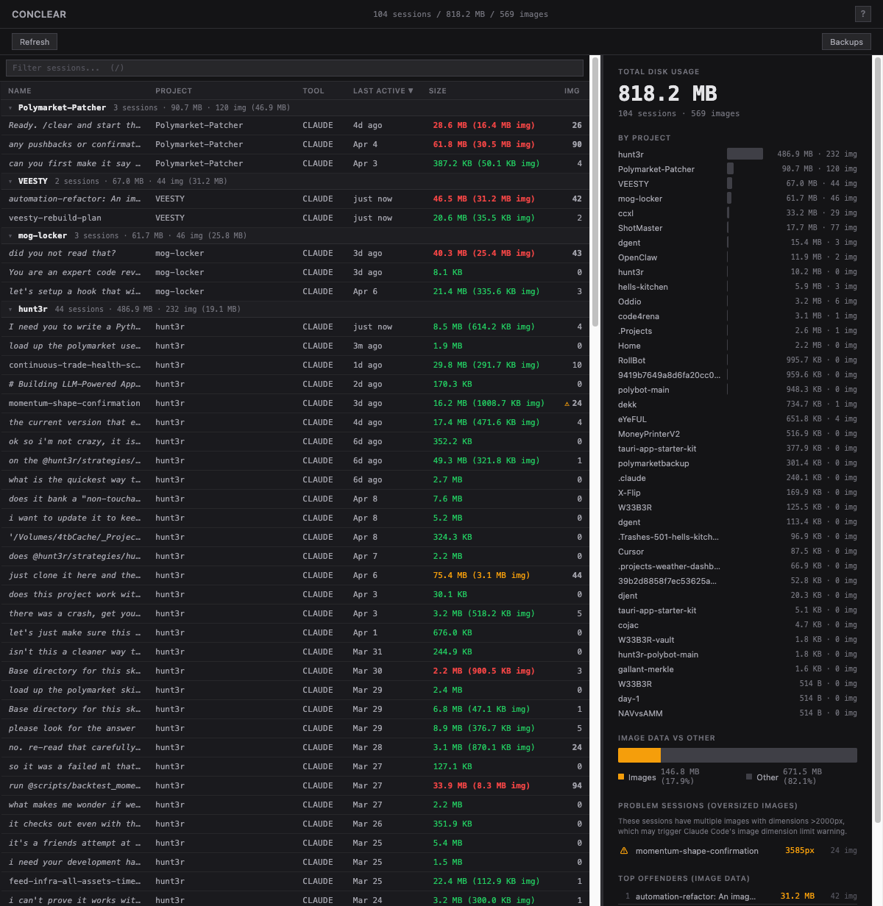
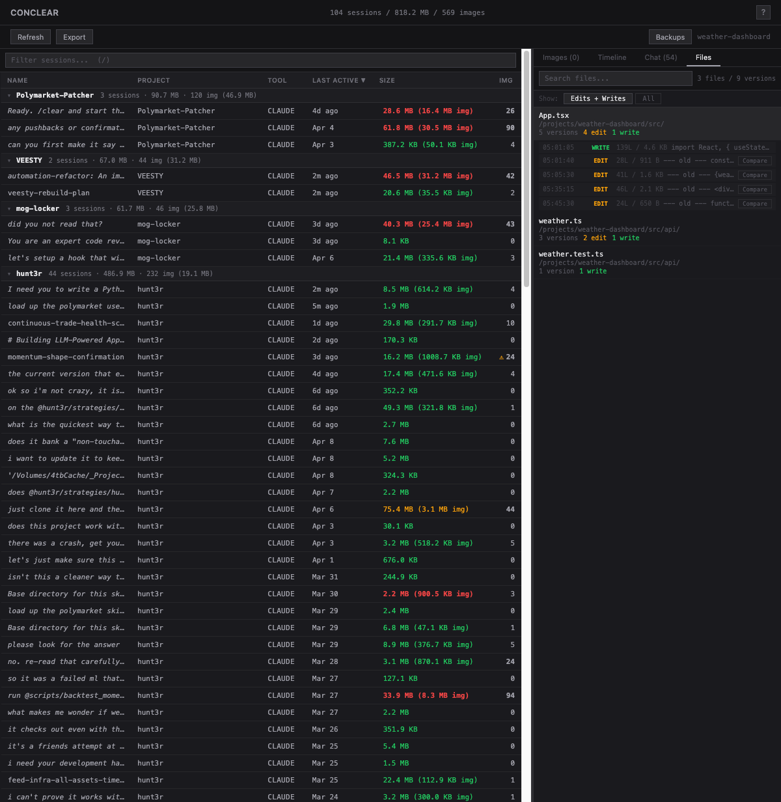
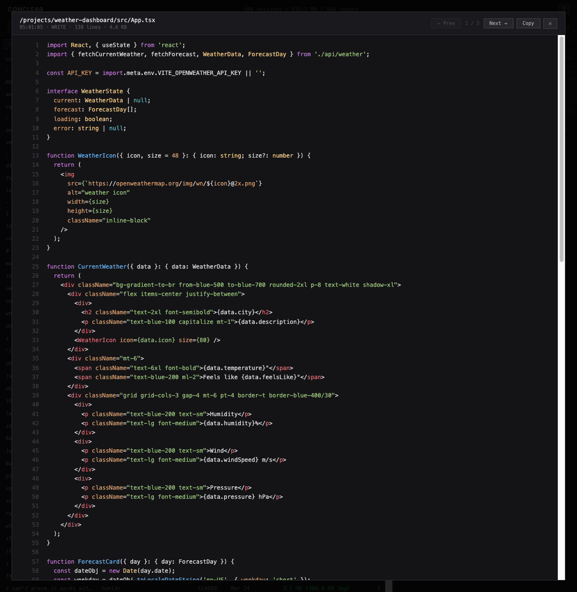
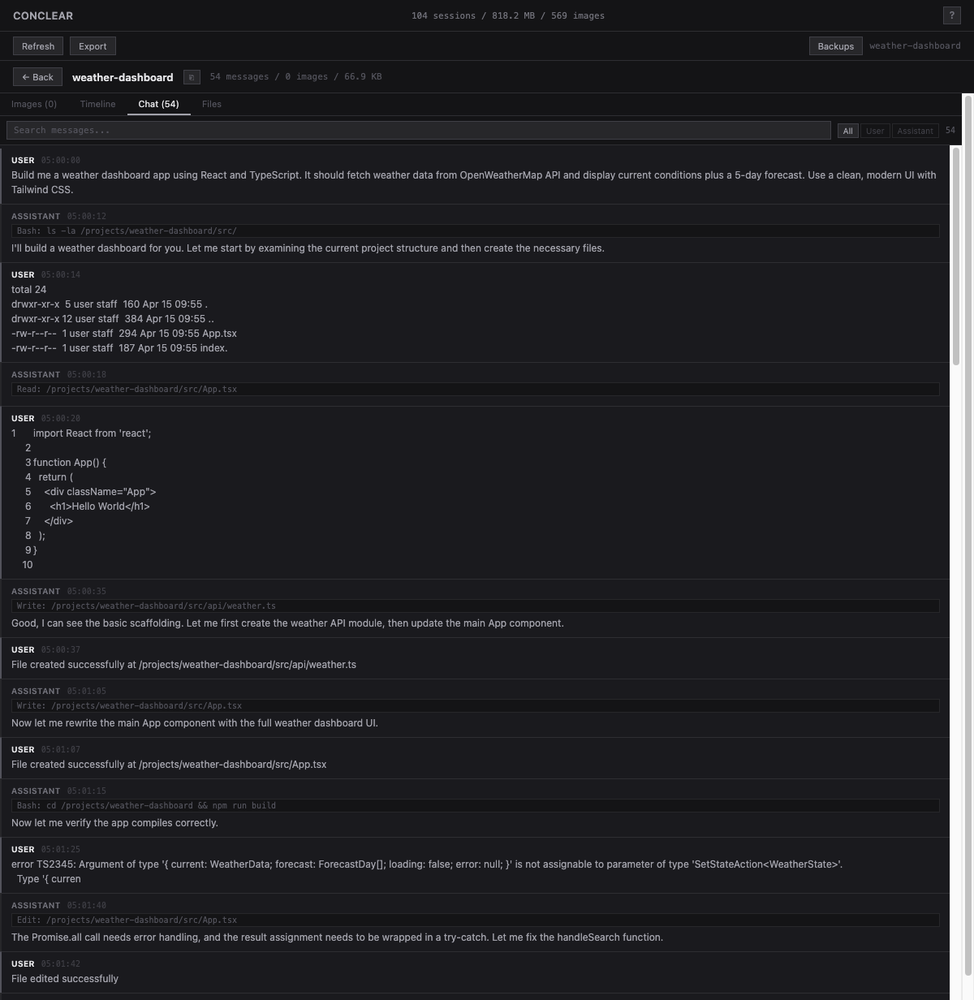
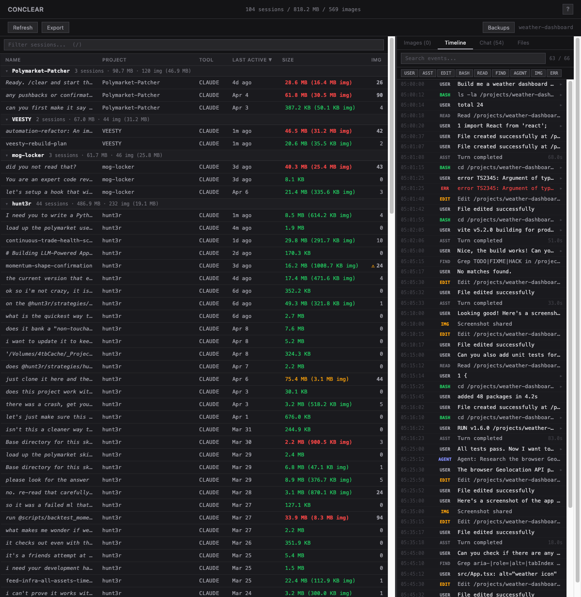

# ConClear

Your AI coding sessions are full of screenshots you'll never look at again. ConClear finds them, shows them to you, and lets you fix the problem before Claude tells you it can't handle your images.

## The problem

Every time you paste a screenshot into Claude Code, Cursor, or any AI coding tool, that image data stays in your session file forever. Sessions grow to 50MB, 100MB, or more. Eventually you get this:

```
An image in the conversation exceeds the dimension limit for many-image requests (2000px).
Run /compact to remove old images from context, or start a new session.
```

ConClear gives you a better option than `/compact` or starting over.

## Install

```bash
npm install -g conclear
```

Or run directly:

```bash
npx conclear
```

## What you get

**A visual session browser** that scans all your AI tool data and shows you exactly what's taking space.



**Image preview and cleanup** — see every screenshot stored in a session. Strip them (replace with a tiny placeholder), resize them (shrink to a target file size), or leave them alone. Your choice, per-image or in bulk.

**File version history** — every file your AI tool read, edited, or wrote is tracked with full content. Browse versions, view with syntax highlighting, compare diffs, copy code.





**Conversation replay** — read through past sessions with clean formatting. Search for specific discussions. Filter by user or assistant messages. Export as markdown.



**Timeline** — event log of everything that happened: edits, bash commands, file reads, errors. Filter by type, search by content.



## Supported tools

ConClear reads session data from these AI coding tools:

| Tool | Format | Status |
|------|--------|--------|
| Claude Code | JSONL | Full support |
| Gemini CLI | JSON | Full support |
| Cursor | SQLite | Full support |
| Cline / Roo Code | JSON | Full support |
| GitHub Copilot Chat | JSON | Full support |

ConClear auto-detects which tools you have installed and scans their session directories. No configuration needed.

Separately, ConClear can be **installed as an MCP server** into 11 AI clients (Claude Code, Claude Desktop, Cursor, Windsurf, VS Code, Google Antigravity, Zed, Cline, Continue, Codex CLI, Kiro CLI) — see [Install into AI clients](#install-into-ai-clients) below.

For an honest map of *everything* ConClear can do today — including emergent uses agents have discovered and known limitations — see [docs/src/what-is-conclear.md](docs/src/what-is-conclear.md).

## CLI

Query your session history from the terminal — no server needed. Useful for quick lookups and for AI agents that need context from past sessions.

```bash
# List recent sessions
conclear sessions

# Search across all conversations
conclear search "auth middleware" --project myapp

# Find file versions
conclear files "api.ts" --latest

# Get a session summary
conclear summary veesty-rebuild-plan

# Dump conversation for piping
conclear context my-session | head -100

# Export as markdown
conclear export my-session --output session.md
```

All commands support `--json` for structured output.

## MCP server

ConClear runs as an MCP server so AI agents can query your session history through tool use:

```bash
conclear mcp                  # stdio (default)
conclear mcp --http            # Streamable HTTP on :7331
conclear mcp --http --port N   # custom port
```

Tools available: `conclear_search`, `conclear_sessions`, `conclear_summary`, `conclear_file_content`, `conclear_context`.

## Install into AI clients

`conclear install` wires the MCP server (and Skill, where supported) into your AI clients automatically — no manual config edits:

```bash
conclear install              # detect & install into every supported client
conclear install --all        # install everywhere, even undetected clients
conclear install --cursor --claude-code   # specific clients
conclear install --no-skill   # MCP only, skip skills
conclear uninstall            # same flags
conclear doctor               # show install status per client
```

| Client | MCP | Skill | Notes |
|---|---|---|---|
| Claude Code | ✓ | ✓ | uses `claude mcp add` |
| Claude Desktop | ✓ | — | restart required |
| Cursor | ✓ | ✓ | skills since v2.2 |
| Windsurf | ✓ | — | ~100-tool cap surfaced in `doctor` |
| VS Code (Copilot) | ✓ | — | uses `code --add-mcp` |
| Google Antigravity | ✓ | ✓ | |
| Zed | ✓ | — | comments preserved (JSONC) |
| Cline | ✓ | — | |
| Codex CLI | ✓ | — | uses `codex mcp add` |
| Kiro CLI | ✓ | — | |
| Continue | manual | — | prints YAML snippet to paste |

All edits are backed up to `~/.conclear/backups/`. Full reference: [`docs/src/install.md`](docs/src/install.md).

If you'd rather wire ConClear up by hand, the canonical MCP entry is:

```json
{
  "mcpServers": {
    "conclear": {
      "command": "conclear",
      "args": ["mcp"]
    }
  }
}
```

## Problem detection

ConClear automatically flags sessions that would trigger the 2000px dimension limit warning — before it happens. Look for the amber warning icon in the session list.

## Keyboard shortcuts

| Key | Action |
|-----|--------|
| `/` | Focus search |
| `Up` / `Down` | Navigate sessions |
| `Enter` | Select session |
| `Escape` | Close panel / lightbox / clear search |
| `Cmd+R` | Refresh |
| Double-click | Expand session to full view |
| Right-click | Context menu (strip, resize, copy resume command) |

## How it works

ConClear runs a local server that reads session files directly from disk. No data leaves your machine. The React frontend presents the data and sends operation requests back to the server.

Before any destructive operation (strip, resize), a timestamped backup is created in `~/.conclear/backups/`. You can manage backups from the UI.

The architecture uses an adapter pattern — each AI tool gets its own parser. Adding support for a new tool means writing one adapter file.

## Building from source

```bash
git clone https://github.com/ItsCodejac/conclear
cd conclear
npm install
npm run dev        # Development (Vite + Express)
npm run build      # Production build
npm start          # Run production server
```

## License

MIT
